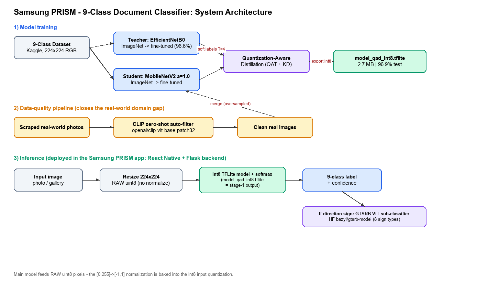
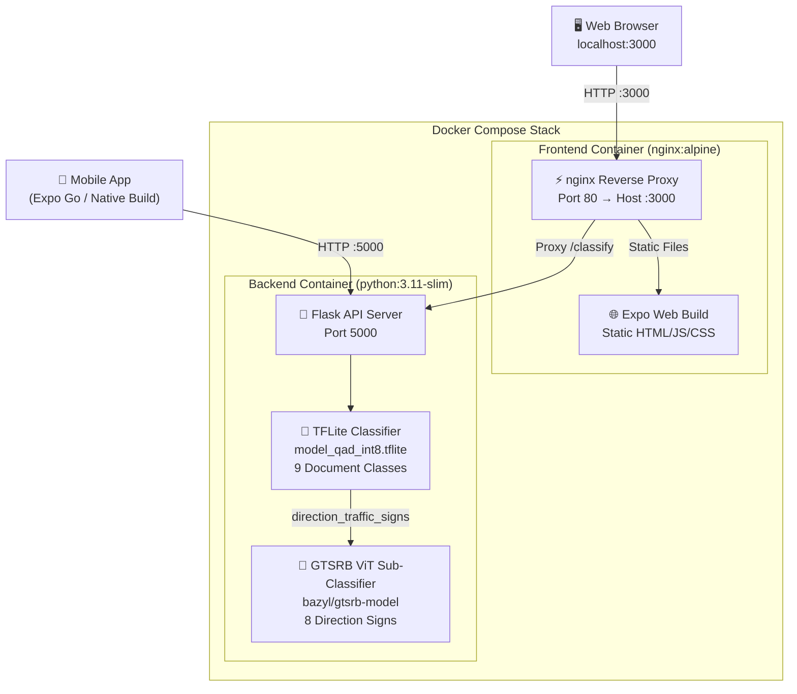
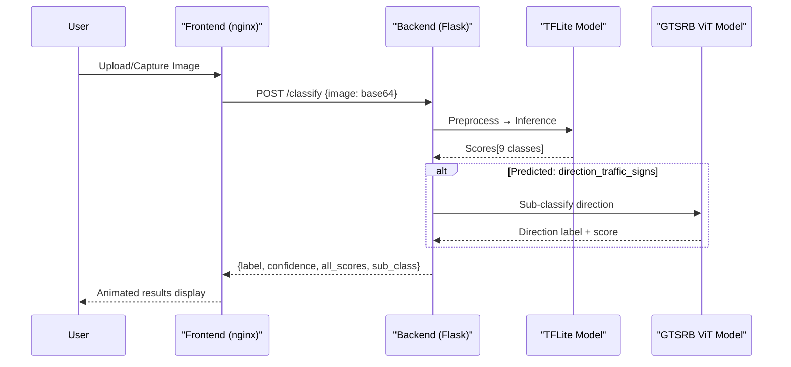

# 🔬 Samsung PRISM — Document Classifier

<div align="center">

**AI-Powered Document Classification using On-Device Machine Learning**

[](https://docs.expo.dev/versions/v56.0.0/)
[](https://reactnative.dev/)
[](https://www.tensorflow.org/lite)
[](https://pytorch.org/)
[](https://flask.palletsprojects.com/)
[](https://docs.docker.com/compose/)
[](LICENSE)

*Capture → Classify → Understand — in milliseconds.*

</div>

---

## 📖 Overview

Samsung PRISM Document Classifier is a full-stack AI application that classifies document images into **9 categories** in real-time. Built as part of the **Samsung PRISM (Preparing and Inspiring Students for Mastery)** research program, it combines a React Native mobile/web frontend with a Python ML inference backend.

When a document is identified as a **direction traffic sign**, a secondary Vision Transformer (ViT) sub-classifier further identifies the specific sign type from 8 direction categories.

---

## ✨ Features

| Feature | Description |
|---|---|
| 📷 **Live Camera Capture** | Real-time document scanning with animated viewfinder and guide overlays |
| 🖼️ **Gallery Import** | Pick images from device gallery for classification |
| 🧠 **9-Class Document AI** | Classifies: Magazine Covers, Movie Posters, Books, Business Cards, Traffic Signs, Government IDs, Maps, Menus, Newspapers |
| 🚦 **Traffic Sign Sub-Classification** | GTSRB ViT model identifies 8 direction sign types (Turn right, Keep left, Roundabout, etc.) |
| ⚡ **Real-Time Inference** | INT8 quantized TFLite model delivers millisecond-level predictions |
| 📊 **Confidence Visualization** | Animated score bars for all 9 categories with top-3 highlighting |
| 🌙 **Samsung One UI Dark Theme** | Premium dark interface inspired by Samsung's design language |
| 🐳 **Fully Dockerized** | One-command deployment with Docker Compose |
| 🌐 **Cross-Platform** | Runs on Android, iOS, and Web browsers |

---

## 🚀 Live Demo (Kaggle — no setup)

Try the model in your browser:
**https://www.kaggle.com/code/siddhm11/samsung-prism-document-classifier-demo**

- **Just look:** open the link — it already shows finished outputs (real-world photos
  classified with confidence; green = correct).
- **Run it:** click **Copy & Edit → Run → Run All**. The model and sample images are
  pre-attached as public data — no installs, no internet needed.
- **Try your own image:** right panel → **Add Data → Upload**, set
  `TEST_IMAGE = '/kaggle/input/<your-file>'` in the last cell, and re-run it.

### Run locally
```bash
pip install pillow numpy ai-edge-litert
python inference.py path/to/image.jpg      # or: python inference.py samples/
```
The model takes raw 224×224 uint8 pixels (normalization is baked into the int8
quantization) and returns a 9-class label + confidence.

See **[docs/DEMO.md](docs/DEMO.md)** for how to run the live demo.

---

## 🏗️ Architecture

See **[docs/ARCHITECTURE.md](docs/ARCHITECTURE.md)** for the system architecture diagram,
**[docs/MODELS.md](docs/MODELS.md)** for the models used and fine-tuning details, and
**[docs/REFERENCES.md](docs/REFERENCES.md)** for the GitHub/HuggingFace sources.


*ML training & inference pipeline*


*Docker deployment stack*

### Request Flow



---

## 🐳 Docker Quick Start

### Prerequisites

- [Docker Engine](https://docs.docker.com/engine/install/) ≥ 20.10
- [Docker Compose](https://docs.docker.com/compose/install/) ≥ 2.0
- **~6 GB disk space** (ML models: TensorFlow + PyTorch CPU + ViT weights)
- **~4 GB RAM** available for the backend container

### 🚀 One-Command Launch

```bash
# Clone the repository
git clone https://github.com/HarshithaKss/samsung-prism-app.git
cd samsung-prism-app

# Build and start the full stack
docker compose up --build -d
```

That's it! Wait ~2 minutes for the backend to load ML models, then open:

| Service | URL | Purpose |
|---|---|---|
| **Web App** | [http://localhost:3000](http://localhost:3000) | Document classifier UI |
| **API Server** | [http://localhost:5000](http://localhost:5000) | Flask inference backend |
| **Health Check** | [http://localhost:5000/health](http://localhost:5000/health) | Backend status & model info |

### 🛑 Stopping

```bash
# Stop all containers
docker compose down

# Stop and remove volumes/images
docker compose down --rmi all --volumes
```

---

## 🔧 Docker Commands Reference

```bash
# Build images without starting containers
docker compose build

# Start in foreground (see all logs)
docker compose up

# Start in background (detached)
docker compose up -d

# View live logs
docker compose logs -f

# View logs for a specific service
docker compose logs -f backend
docker compose logs -f frontend

# Check container status
docker compose ps

# Restart a specific service
docker compose restart backend

# Rebuild a specific service after code changes
docker compose up --build backend

# Execute a shell inside the backend container
docker exec -it prism-backend bash

# Execute a shell inside the frontend container
docker exec -it prism-frontend sh
```

---

## 📁 Project Structure

```
samsung-prism-app/
├── 🐳 Docker
│   ├── Dockerfile.backend        # Python ML inference server image
│   ├── Dockerfile.frontend       # Multi-stage: Node build → nginx serve
│   ├── docker-compose.yml        # Orchestration for full stack
│   ├── nginx.conf                # Reverse proxy & static file server
│   └── .dockerignore             # Build context exclusions
│
├── 🐍 Backend (Flask API)
│   ├── server.py                 # Flask server with /classify & /health endpoints
│   ├── requirements.txt          # Python dependencies
│   └── model/
│       ├── model_qad_int8.tflite # Primary INT8 quantized classifier (2.6 MB)
│       └── prism_classifier_1.tflite  # Alternative model (unused)
│
├── 📱 Frontend (Expo / React Native)
│   ├── App.js                    # Full application (1800+ lines, single-file)
│   ├── index.js                  # Expo entry point
│   ├── app.json                  # Expo configuration
│   ├── package.json              # npm dependencies
│   └── assets/                   # App icons, splash screen, favicon
│
├── 🔧 Utilities
│   ├── repack.py                 # PyTorch model repacking utility
│   └── eas.json                  # Expo Application Services build config
│
└── 📄 Documentation
    ├── README.md                 # This file
    ├── LICENSE                   # MIT License
    └── AGENTS.md                 # AI agent instructions
```

---

## 🔌 API Documentation

### `POST /classify`

Classify a document image into one of 9 categories.

**Request:**
```json
{
  "image": "<base64-encoded-image-string>"
}
```

**Response:**
```json
{
  "label": "business_cards",
  "confidence": 0.9847,
  "all_scores": [0.001, 0.002, 0.003, 0.985, 0.001, 0.002, 0.003, 0.002, 0.001],
  "inference_time_ms": 12,
  "sub_class": null
}
```

**Response (when traffic sign detected):**
```json
{
  "label": "direction_traffic_signs",
  "confidence": 0.9231,
  "all_scores": [0.01, 0.01, 0.01, 0.01, 0.92, 0.01, 0.01, 0.01, 0.01],
  "inference_time_ms": 45,
  "sub_class": "Turn right ahead"
}
```

| Field | Type | Description |
|---|---|---|
| `label` | string | Predicted document class name |
| `confidence` | float | Softmax probability of the top prediction (0–1) |
| `all_scores` | float[] | Softmax probabilities for all 9 classes |
| `inference_time_ms` | int | TFLite inference latency in milliseconds |
| `sub_class` | string\|null | Direction sign sub-label (only for traffic signs) |

### `GET /health`

Health check endpoint for Docker and monitoring.

**Response:**
```json
{
  "status": "ok",
  "model_loaded": true,
  "gtsrb_loaded": true,
  "classes": 9
}
```

---

## 📱 Mobile App Setup (Non-Docker)

For running on physical Android/iOS devices:

### Prerequisites
- [Node.js](https://nodejs.org/) ≥ 18
- [Expo Go](https://expo.dev/go) app on your device
- Python 3.9+ for the backend

### 1. Start the Backend

```bash
# Install Python dependencies
pip install -r requirements.txt

# Start the Flask server
python server.py
```

### 2. Configure the API URL

Edit `App.js` line 30 — set `MOBILE_API_URL` to your machine's local IP:

```javascript
const MOBILE_API_URL = 'http://YOUR_LOCAL_IP:5000';
```

Find your IP:
```bash
# Windows
ipconfig

# macOS / Linux
ifconfig | grep "inet "
```

### 3. Start the Frontend

```bash
# Install dependencies
npm install

# Start Expo dev server
npx expo start
```

Scan the QR code with Expo Go on your device.

---

## 🧠 ML Models

### Primary Classifier — TensorFlow Lite

| Property | Value |
|---|---|
| **File** | `model/model_qad_int8.tflite` |
| **Architecture** | MobileNetV2 (α=1.0), ImageNet → fine-tuned on the 9 classes |
| **Training** | Quantization-Aware **Distillation** (QAD): student distilled from an EfficientNetB0 teacher (T=4, α=0.5), trained quantization-aware, exported to INT8 |
| **Quantization** | Full INT8 (uint8 in/out — normalization baked into the input quantization) |
| **Size** | 2.7 MB |
| **Input / Output** | `[1,224,224,3]` uint8 (raw pixels) → `[1,9]` scores → softmax |
| **Accuracy** | 96.9% on held-out test |

> Full model & fine-tuning details: [docs/MODELS.md](docs/MODELS.md).

### Sub-Classifier — GTSRB ViT (PyTorch)

| Property | Value |
|---|---|
| **Source** | [bazyl/gtsrb-model](https://huggingface.co/bazyl/gtsrb-model) (HuggingFace) |
| **Architecture** | `vit_base_patch16_224` (Vision Transformer) |
| **Framework** | PyTorch + timm |
| **Classes** | 43 (GTSRB), using 8 direction signs (IDs 33–40) |
| **Auto-Downloaded** | Yes, cached during Docker build |

---

## 🛠️ Configuration

| Variable | Location | Default | Description |
|---|---|---|---|
| `MOBILE_API_URL` | `App.js:30` | `http://192.168.1.6:5000` | Backend IP for mobile devices |
| `USE_API` | `App.js:32` | `true` | Toggle API vs offline mock mode |
| `API_TIMEOUT_MS` | `App.js:33` | `10000` | Request timeout in milliseconds |
| `MODEL_PATH` | `server.py:96` | `model/model_qad_int8.tflite` | TFLite model path |
| `TF_CPP_MIN_LOG_LEVEL` | `docker-compose.yml` | `2` | TensorFlow log verbosity |

---

## 🐳 Docker Image Details

| Image | Base | Approx. Size | Contents |
|---|---|---|---|
| `prism-backend` | `python:3.11-slim` | ~4–5 GB | TensorFlow, PyTorch (CPU), timm, GTSRB ViT weights, TFLite model |
| `prism-frontend` | `nginx:1.27-alpine` | ~25 MB | Static HTML/JS/CSS from Expo web export |

> **Note:** The backend image is large due to ML framework dependencies (TensorFlow ~500MB, PyTorch CPU ~200MB, ViT model weights ~350MB). This is standard for ML inference containers. The frontend image is kept tiny by using a multi-stage build that discards Node.js and node_modules after compilation.

---

## 📄 License

This project is licensed under the **MIT License** — see the [LICENSE](LICENSE) file for details.

---

<div align="center">

**Built with ❤️ as part of the Samsung PRISM Program**

*Preparing and Inspiring Students for Mastery*

</div>
