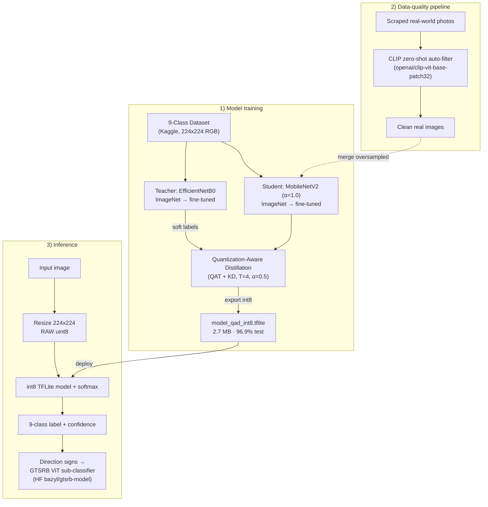

# System Architecture

Samsung PRISM — 9-Class Document Image Classifier.

## Overview
The system has three stages:

1. **Model training** — an EfficientNetB0 **teacher** and a MobileNetV2 **student** are
   fine-tuned on the 9-class dataset. The student is then trained with **Quantization-Aware
   Distillation (QAD)** — quantization-aware training while learning from the teacher's soft
   labels — and exported to a **full-int8 TFLite** model (`model_qad_int8.tflite`, 2.7 MB).
2. **Data-quality pipeline** — real-world photos are scraped and auto-filtered with **CLIP
   zero-shot** classification (keeping only correctly-labelled images), then merged into the
   training set to close the clean-scan → real-photo domain gap.
3. **Inference** — an image is resized to 224×224 (raw uint8, no normalization — the
   `[0,255]→[-1,1]` scaling is baked into the int8 input quantization), run through the int8
   model + softmax, giving a 9-class label + confidence. If the prediction is a **direction
   traffic sign**, a GTSRB Vision-Transformer sub-classifier identifies the specific sign type.

## Diagram (GitHub-rendered)

See [`MODELS.md`](MODELS.md) for model/fine-tuning details and
[`REFERENCES.md`](REFERENCES.md) for the GitHub/HuggingFace sources used.
